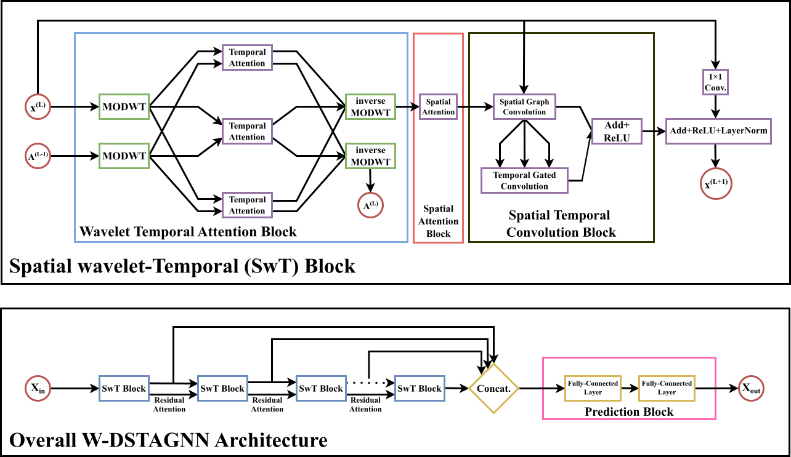

# W-DSTAGNN

Wavelet-based Temporal Attention Improves Traffic Forecasting



# Requirements

+ python >= 3.5
+ scipy
+ tensorboardX
+ pytorch
+ scikit-learn
+ tqdm

# Datasets

W-DSTAGNN is implemented on these public traffic datasets.
- **PEMSBAY** from [DCRNN (ICLR-18)](https://github.com/liyaguang/DCRNN)
- **PEMS03**, **PEMS04** from [STSGCN (AAAI-20)](https://github.com/Davidham3/STSGCN)
All datasets can be found in .npz format with the only key being 'data' in [Google drive](https://drive.google.com/drive/folders/17yQmHb_4rMudLTx9GcPvGiUrOrIncIHT?usp=sharing). The shape of input traffic data should be (Total_Time_Steps, Node_Number).

Processing the datasets:

- on PEMSBAY dataset

  ```shell
  python prepareData.py --config configurations/PEMSBAY_dstagnn.conf
  ```

- on PEMS03 dataset

  ```shell
  python prepareData.py --config configurations/PEMS03_dstagnn.conf
  ```

- on PEMS04 dataset

  ```shell
  python prepareData.py --config configurations/PEMS04_dstagnn.conf
  ```


# Spatial-Temporal Aware Graph Construction
The graphs can be generated by code:
```
cd ./data/
python STAG_gen.py
```

The calculation uses CPU, which should be prepared for enough computation resources.


# Train and Test

- on PEMSBAY dataset  
  
  ```shell   
  python train_DSTAGNN.py --config configurations/PEMSBAY_dstagnn.conf   
  ```

- on PEMS03 dataset  
  
  ```shell   
  python train_DSTAGNN.py --config configurations/PEMS03_dstagnn.conf   
  ```

- on PEMS04 dataset  
  
  ```shell   
  python train_DSTAGNN.py --config configurations/PEMS04_dstagnn.conf   
  ```
  
# Configuration

The configuration file config.conf contains two parts: Data, Training:

## Data

+ adj_filename: path of the adjacency matrix file
+ graph_signal_matrix_filename: path of graph signal matrix file
+ stag_filename: path of the Spatial-Temporal Aware Grap file
+ strg_filename: path of the Spatial-Temporal Relevance Graph file
+ num_of_vertices: number of vertices
+ points_per_hour: points per hour, in our dataset is 12
+ num_for_predict: points to predict, in our model is 12
+ len_input: length of each input to the model, in our model is 12
+ dataset_name: name of the dataset

## Training

+ graph: select the graph structure, G or AG, G stands for adjacency graph, AG stands for Spatial-Temporal Aware Graph
+ ctx: set ctx = cpu, or set gpu-0, which means the first gpu device
+ in_channels: number of channels for spatial convolution
+ n_heads: int, number of temporal att heads will be used
+ K: int, K-order chebyshev polynomials (number of spatial att heads) will be used 
+ d_k: int, the dimensions of the Q, K, and V vectors will be used
+ d_model: int, d_E
+ batch_size: int
+ model_name: name of the model
+ num_of_weeks: int, how many weeks' data will be used
+ num_of_days: int, how many days' data will be used
+ num_of_hours: int, how many hours' data will be used
+ epochs: int
+ learning_rate: float

# Citation

If you find this repository useful in your research, please cite the following paper:
```
@inproceedings{wdstagnn,
  title={Wavelet-based Temporal Attention Improves Traffic Forecasting},
  author={Jakhmola, Yash and Kumar Mishra, Nitish and Ghosh, Kripabandhu and Chakraborty, Tanujit},
  year={2024}
}
```
